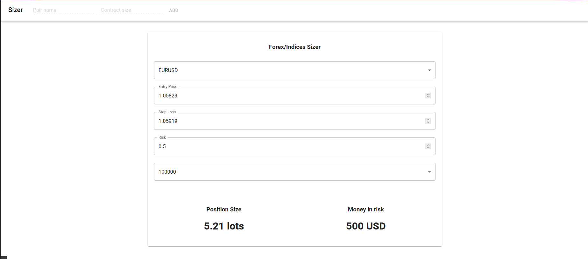

# Sizer

This project aims to facilitate traders lives by calculating position size accordingly to their entry and SL on a specified asset.
⚠️ Contract sizes used here are Eightcap ones, it may vary along your broker ⚠️

## Run the project

In the project directory, you can run:

### `npm start`

Runs the app in the development mode.\
Open [http://localhost:3000](http://localhost:3000) to view it in your browser.

The page will reload when you make changes.\
You may also see any lint errors in the console.

